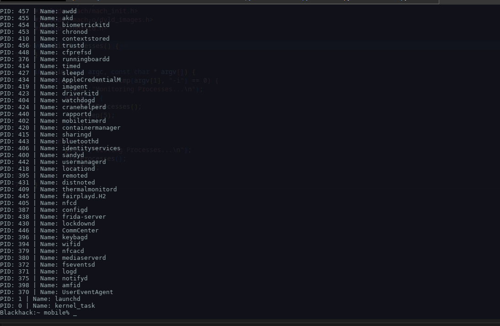

# iProcDump

Simple Process Dumper. Allows for a more managable time searching for PIDS instead of doing 

<ps aux | grep containers | awk '{FS = " ";}{pid = $2;cid = $7; path = substr($11, index($11, "/Applications"));}>

## Usage
pd :
Dumps Process Names and IDs

pd -i :
Becomes Interactive and Updates PIDS (Beta Feature)

